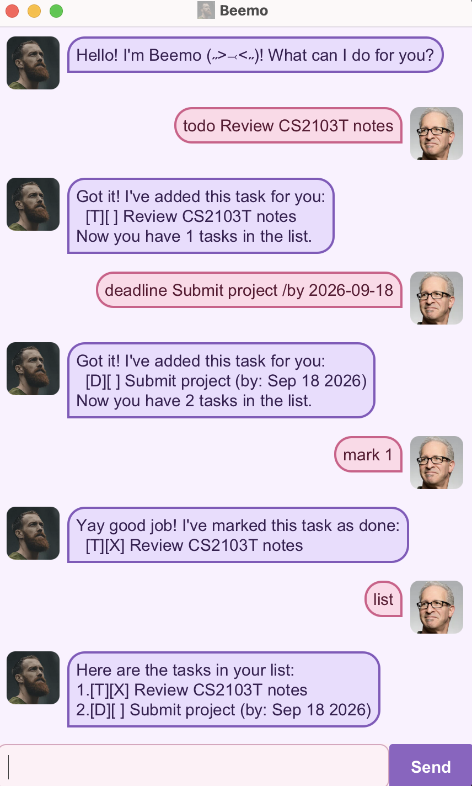

# Beemo User Guide

Beemo is a friendly desktop chatbot that helps you keep track of todos,
deadlines, and events using simple text commands. Your tasks are saved
automatically, so they remain available the next time you open Beemo.



## Quick start

1. Download `beemo.jar`.
2. Ensure Java 25 is installed on your computer.
3. Open a terminal in the folder containing the JAR file.
4. Run the following command:

   ```text
   java -jar beemo.jar
   ```

5. Type a command in the box at the bottom of the window and select
   **Send**, or press **Enter**.

You can enter `help` at any time to see the available commands.

## Understanding the task list

Beemo displays each task with a type and status symbol:

| Symbol | Meaning |
|---|---|
| `[T]` | Todo |
| `[D]` | Deadline |
| `[E]` | Event |
| `[ ]` | Not completed |
| `[X]` | Completed |

Task numbers start from `1`. Use the number shown by `list` when marking,
unmarking, or deleting a task.

## Command summary

| Action | Command format |
|---|---|
| Add a todo | `todo DESCRIPTION` |
| Add a deadline | `deadline DESCRIPTION /by yyyy-MM-dd` |
| Add an event | `event DESCRIPTION /from START /to END` |
| Show all tasks | `list` |
| Find tasks | `find KEYWORD` |
| Mark a task as completed | `mark TASK_NUMBER` |
| Mark a task as incomplete | `unmark TASK_NUMBER` |
| Delete a task | `delete TASK_NUMBER` |
| Show command help | `help` |
| Exit Beemo | `bye` |

## Features

### Adding a todo: `todo`

Adds a task without a date or time.

Format: `todo DESCRIPTION`

Example:

```text
todo Review CS2103T notes
```

### Adding a deadline: `deadline`

Adds a task that must be completed by a specific date. Enter the date in
`yyyy-MM-dd` format; Beemo will display it in a friendlier form.

Format: `deadline DESCRIPTION /by yyyy-MM-dd`

Example:

```text
deadline Submit project /by 2026-09-18
```

### Adding an event: `event`

Adds a task that takes place between a start and an end time. The start and
end values can be written as meaningful text.

Format: `event DESCRIPTION /from START /to END`

Example:

```text
event Team consultation /from 3pm /to 4pm
```

### Viewing tasks: `list`

Shows every task and its current number and completion status.

Format: `list`

### Finding tasks: `find`

Shows tasks whose descriptions contain the given keyword. Matching is not
case-sensitive, so `find book` also matches `Read Book`.

Format: `find KEYWORD`

Example:

```text
find project
```

### Marking a task as completed: `mark`

Marks the numbered task as completed. Run `list` first if you are unsure of
the task number.

Format: `mark TASK_NUMBER`

Example:

```text
mark 1
```

### Marking a task as incomplete: `unmark`

Changes a completed task back to incomplete.

Format: `unmark TASK_NUMBER`

Example:

```text
unmark 1
```

### Deleting a task: `delete`

Permanently removes the numbered task from the list. The remaining tasks may
receive new numbers afterward.

Format: `delete TASK_NUMBER`

Example:

```text
delete 2
```

### Viewing command help: `help`

Shows a quick reference of every command supported by Beemo.

Format: `help`

### Exiting Beemo: `bye`

Closes Beemo. Your latest task list has already been saved automatically.

Format: `bye`

## Command tips

- Commands must begin with the command word shown in this guide.
- Extra leading, trailing, or repeated spaces are accepted.
- Deadline dates must use the exact `yyyy-MM-dd` format, such as
  `2026-09-18`.
- Event commands require both `/from` and `/to`.
- If Beemo cannot understand an entry, follow the guidance in its error
  message or enter `help`.

## Data storage

Beemo saves task changes automatically in `data/beemo.txt`. If the file does
not exist when Beemo starts, it creates a new task list when you add your
first task. Avoid editing the data file manually, as invalid contents may
prevent saved tasks from loading.
